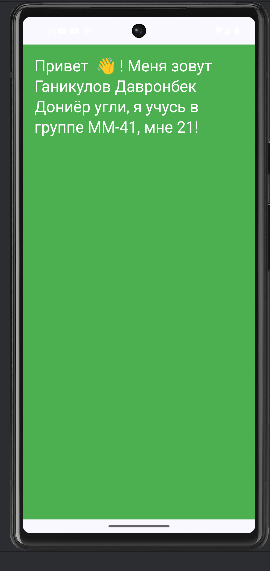

# FirstApp
 Ганикулов Давронбек Дониёр угли первое приложение

 

 
Практика: Измените текст на ваше имя
Измените вызов функции Greeting: ** Измените text = "Привет, меня зовут $name, я учусь в группе !",** На Greeting("ФИО Группа Возраст")

Вместо " ФИО Группа Возраст" введите свои данные.
